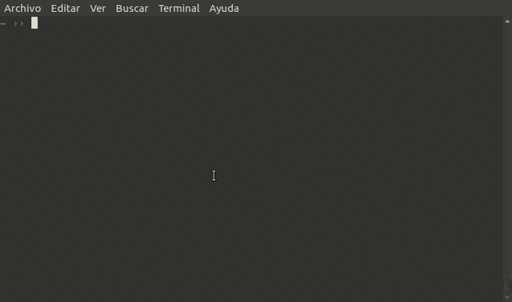

# oh-my-zsh-bunnyruni-theme

Bunnyruni theme based on my favorite themes, functions and colors.



For installing

```
  $ mkdir -p $ZSH_CUSTOM/themes && curl https://raw.githubusercontent.com/jopcode/oh-my-zsh-bunnyruni-theme/master/bunnyruni.zsh-theme -L -o $ZSH_CUSTOM/themes/bunnyruni.zsh-theme
```
Set the theme in your **.zshrc** file 

```
  ZSH_THEME="bunnyruni"
```

And Done <3!
